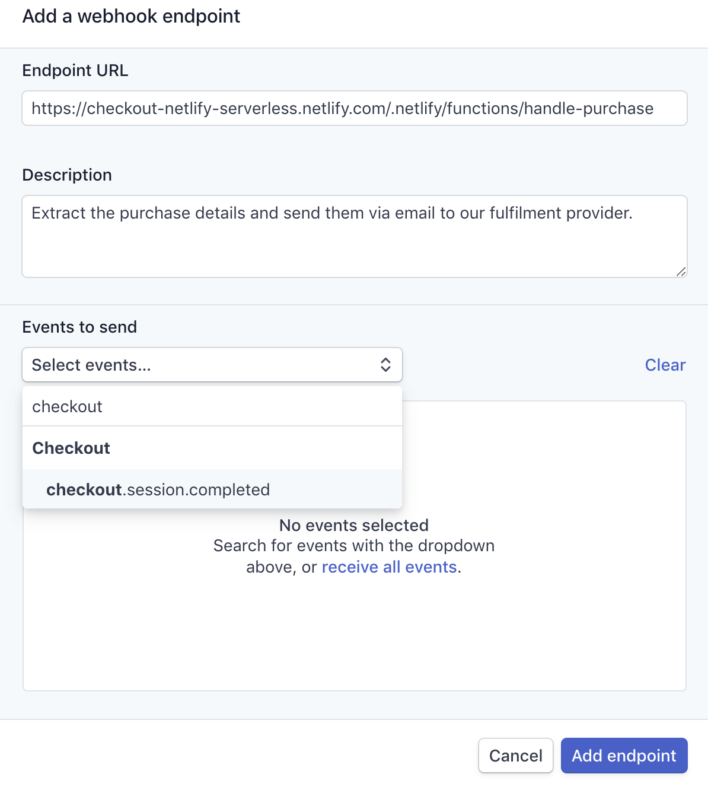
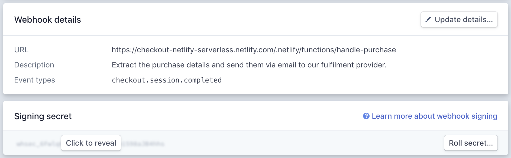

# Handling Stripe Webhook events with Netlify Functions

When selling products on your JAMstack site you can use Netlify Functions to automate your fulfillment process. In this tutorial, which is an addition to [Learn How to Accept Money on Jamstack Sites](https://www.netlify.com/blog/2020/04/13/learn-how-to-accept-money-on-jamstack-sites-in-38-minutes/), you'll learn how to automatically send an email to your fulfillment provider when a payment has been made so that they can send out the goods to your customers.

Sending an email is just an example of an action that you can take when receiving a webhook from Stripe, you could alternatively update your database, make a request to your inventory API etc.

## Set your environment variables in Netlify

In your "Deploy settings" under "Environment" add the following variables which we need to handle the webhook events and send emails with Sendgrid:

| Variable                    | Description                                                         |
| :-------------------------- | :------------------------------------------------------------------ |
| `SENDGRID_API_KEY`          | [Your SendGrid API key](https://app.sendgrid.com/settings/api_keys) |
| `FULFILLMENT_EMAIL_ADDRESS` | The email address of your fulfillment provider                      |
| `FROM_EMAIL_ADDRESS`        | Your email address that SendGrid will send the email from           |
| `STRIPE_WEBHOOK_SECRET`     | Your webhook secret. Read below how to create it                    |

Next, install the Stripe and Sendgrid Node.js client dependencies:

```bash
# move into the functions directory
cd functions/

# install Stripe & Sendgrid
npm i stripe && npm i @sendgrid/mail

# move back to the project root
cd ..
```

## Create a serverless function receive the webhook event and send the email

In your functions folder, create a new file: `functions/handle-purchase.js`. This function will receive the Stripe webhook event (a POST request sent from Stripe when the payment was successful), verify that the request is legitimate, extract the purchase details and send them via email to our fulfillment provider.

```js
const stripe = require('stripe')(process.env.STRIPE_SECRET_KEY);

const sgMail = require('@sendgrid/mail');
sgMail.setApiKey(process.env.SENDGRID_API_KEY);

exports.handler = async ({ body, headers }) => {
  try {
    const stripeEvent = stripe.webhooks.constructEvent(
      body,
      headers['stripe-signature'],
      process.env.STRIPE_WEBHOOK_SECRET
    );

    if (stripeEvent.type === 'checkout.session.completed') {
      const eventObject = stripeEvent.data.object;
      const items = eventObject.display_items;
      const shippingDetails = eventObject.shipping;

      // Send and email to our fulfillment provider using Sendgrid.
      const purchase = { items, shippingDetails };
      const msg = {
        to: process.env.FULFILLMENT_EMAIL_ADDRESS,
        from: process.env.FROM_EMAIL_ADDRESS,
        subject: `New purchase from ${shippingDetails.name}`,
        text: JSON.stringify(purchase, null, 2),
      };
      await sgMail.send(msg);
    }

    return {
      statusCode: 200,
      body: JSON.stringify({ received: true }),
    };
  } catch (err) {
    console.log(`Stripe webhook failed with ${err}`);

    return {
      statusCode: 400,
      body: `Webhook Error: ${err.message}`,
    };
  }
};
```

### Verify the webhook signature

Since this will instruct our fulfillment provider to send out physical goods, we need to make sure that this request was actually sent by Stripe and not created by a malicious third-party.

For this we use our `STRIPE_WEBHOOK_SECRET` and the `stripe.webhooks.constructEvent` helper from stripe-node. When testing locally, the webhook secret will be returned to you by the Stripe CLI, otherwise you will retrieve the webhook secret from the Stripe Dashboard when creating your pdouction webhook endpoint.

## Forward webhook events to your local server with the Stripe CLI

In the [previous tutorial]() you've learned how to run your functions locally using `ntl dev`. Testing webhook events locally can be challenging since your local server (localhost) is not reachable via the internet.

That's why Stripe provides a CLI that allows you to forward your webhook events to your server running locally.

[Install the CLI](https://stripe.com/docs/stripe-cli) and [link your Stripe account](https://stripe.com/docs/stripe-cli#link-account).

In a separate tab run

```bash
stripe listen --forward-to localhost:8888/.netlify/functions/handle-purchase
```

The CLI will print a webhook secret key to the console. Set `STRIPE_WEBHOOK_SECRET` to this value in your Netlify "Deploy settings" under "Environment".

> Note: After setting the webhook secret in your Netlify dashboard you will need to stop and restart `ntl dev` for it to be available locally.

## Deploy to production

When you're ready to move things to live mode, add a new webhook endpoint in your [Stripe Dashboard](https://dashboard.stripe.com/webhooks):

- Endpoint URL: https://your-domain.com/.netlify/functions/handle-purchase
- Events to send: `checkout.session.completed`



After you click the "Add endpoint" button, you will see your webhook details, including a panel to reveal the webhook secret.



Click the "Click to reveal" button and copy the webhook secret to your Netlify environment settings.

> Note: After setting the webhook secret in your Netlify dashboard you will need to redeploy your site for it to be available in your function.

That's it, you're now able to programmatically handle Stripe webhook events to automate fulfillment for your JAMstack e-commerce site.
